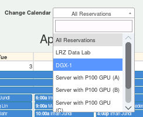
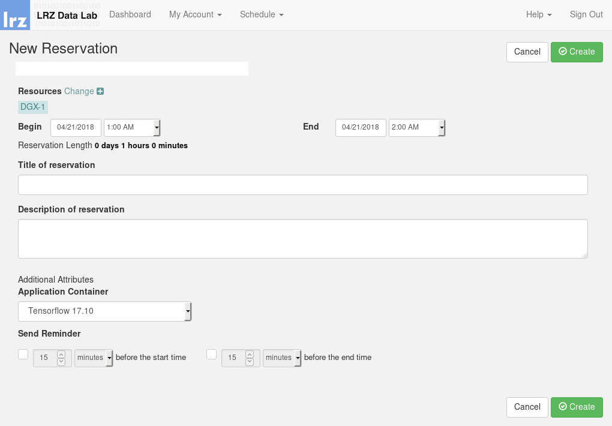

# LRZ GPU tutorial

This repository contains some hints for using the LRZ GPUs (mainly the
[*DGX-1*](https://www.lrz.de/services/compute/special_systems/machine_learning/)
supercomputer).

**Notice**: This is not an official repository from LRZ.

## SSH-key setup

In order to properly login into reserved container, it is very imporant to create
a private/public SSH key pair.

Please refer to the [LRZ documentation](https://www.lrz.de/services/compute/ssh/)
for setting up a SSH-key pair. Another excellent reference is the
[GitLab](https://docs.gitlab.com/ee/ssh/) documentation.

**Notice**: It is very important that you use a strong password for your new
SSH key pair. The LRZ security policies forbid any empty key! So you are forced
to enter a password.

### Optional: strong encryption for SSH key pair

Following the guidelines from [Secure Secure Shell](https://stribika.github.io/2015/01/04/secure-secure-shell.html)
it is highly recommand to use strong encryption for your SSH key pair. For
example you can use [Ed25519](https://ed25519.cr.yp.to/) to create keys:

```bash
ssh-keygen -t ed25519
```

## Store public SSH-key in LRZ Data Lab

Once the SSH key pair was created, the **public** key must be stored in your
settings on the Data Lab reservation website.

Visit the [LRZ Data Lab](https://datalab.lrz.de) website. This website is only
accessible within the MWN (Münchner Wissenschaftsnetz). If you're not in the
MWN you can use a VPN connection. In this case you can find necessary
information [here](https://www.lrz.de/services/netz/mobil/vpn/).

Once you have logged into the LRZ Data Lab click on "My Account" and choose
"Profile".

Locate your previously created public key (ending with `.pub`), e.g.:

```bash
cat ~/id_rsa.pub # or use cat ~/id_ed25519.pub in case of Ed25519
```

and copy this into the text field named "SSH Public Key" in the Data Lab. The
next figure shows an example:


## Make reservation

Once you have stored your public SSH key in your profile settings, you can
make a reservation e.g. on the *DGX-1*.

Goto "Schedule" and click on "Resource Calender". Now you can see the full
calender with all booked reservations. Under the "Change Calendar" option you
can filter the available LRZ resources. We use *DGX-1* now:



Now you can find a free slot in the calendar. Click on a desired calendar date
and choose "Create reservation". The following dialog pops up:



You are now able to specify duration and the desired container. In this example
we choose the latest "TensorFlow" container.

## Login into container

Once your reservation is ready, you will receive an email with the following
subject:

> "Your DGX-1 application "TensorFlow 17.10" is ready.

Within the MWN you can now login into the container using your previously
created key:

```bash
ssh -p 10022 -l <your-lrz-kennung> -i ~/id_rsa.pub <ip-address-mail>
```

You need to specify your LRZ kennung, public key and the IP address of the
container. You find the IP address in the email.

You will be asked for your password of the SSH key. When everything was setup
correctly you are now logged in. Congratulations!

# Container - first steps

Inside the container you can install your desired software packages. The
next steps shows the installation of some very useful tools when you are working
in the container.

## Update

It is highly recommended to update the Ubuntu package list via:

```bash
sudo apt update
```

## Byobu

Byobu is a nice text-based window manager and terminal multiplexer. Why should
you use it? Imagine you are training a very deep neural network that usually
takes several hours. When your internet connection is suddenly interrupted,
your connection to the container is also capped and the training is also aborted.

Just use this little tool `byobu` and you can "resume" your terminal connection.

It can be installed via:

```bash
sudo apt install byobu
```

Now start a new terminal session with:

```bash
byobu
```

and everything will work fine. For more information see
[this](https://www.digitalocean.com/community/tutorials/how-to-install-and-use-byobu-for-terminal-management-on-ubuntu-16-04)
tutorial.

# Acknowledgments

We would like to thank the *Leibniz-Rechenzentrum der Bayerischen Akademie der
Wissenschaften* ([LRZ](https://www.lrz.de/english/)) for giving us access to the
NVIDIA *DGX-1* supercomputer.

# Contact (Bugs, Feedback, Contribution and more)

Contributions to this tutorial are highly welcome!

For questions about this tutorial just open an issue on GitHub here. If you have
any corrections or further improvements please open a pull request.
