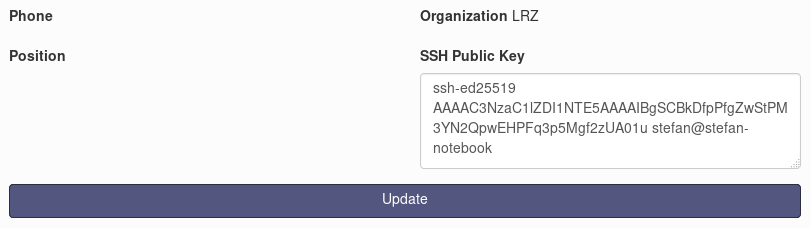

# LRZ GPU tutorial

This repository contains some hints for using the LRZ GPUs (mainly the
[*DGX-1*](https://www.lrz.de/services/compute/special_systems/machine_learning/)
supercomputer and virtual servers with a single P100).

**Notice**: This is not an official repository from LRZ.

## SSH-key setup

In order to properly login into reserved container, it is very imporant to create
a private/public SSH key pair.

Please refer to the [LRZ documentation](https://www.lrz.de/services/compute/ssh/)
for setting up a SSH-key pair. Another excellent reference is the
[GitLab](https://docs.gitlab.com/ee/ssh/) documentation.

**Notice**: It is very important that you use a strong password for your new
SSH key pair. The LRZ security policies forbid any empty key! So you are forced
to enter a password.

### Optional: strong encryption for SSH key pair

Following the guidelines from [Secure Secure Shell](https://stribika.github.io/2015/01/04/secure-secure-shell.html)
it is highly recommand to use strong encryption for your SSH key pair. For
example you can use [Ed25519](https://ed25519.cr.yp.to/) to create keys:

```bash
ssh-keygen -t ed25519
```

## Store public SSH-key in LRZ Data Lab

Once the SSH key pair was created, the **public** key must be stored in your
settings on the Data Lab reservation website.

Visit the [LRZ Data Lab](https://datalab.srv.lrz.de) website. This website is only
accessible within the MWN (Münchner Wissenschaftsnetz). If you're not in the
MWN you can use a VPN connection. In this case you can find necessary
information [here](https://www.lrz.de/services/netz/mobil/vpn/).

Once you have logged into the LRZ Data Lab click on "My Account" and choose
"Profile".

Locate your previously created public key (ending with `.pub`), e.g.:

```bash
cat ~/id_rsa.pub # or use cat ~/id_ed25519.pub in case of Ed25519
```

and copy this into the text field named "SSH Public Key" in the Data Lab. The
next figure shows an example:



## Resources

The LRZ currently provides access to the following GPU systems:

* NVIDIA *DGX-1* with 8 P100
* Virtual server with 1 P100 and *Docker*

Thus, the *DGX-1* tutorial can be found [here](dgx-1.md).

The tutorial for the virtual
server system can be found [here](single-gpu).

## Byobu

Byobu is a nice text-based window manager and terminal multiplexer. Why should
you use it? Imagine you are training a very deep neural network that usually
takes several hours. When your internet connection is suddenly interrupted,
your connection to the container is also capped and the training is also aborted.

Just use this little tool `byobu` and you can "resume" your terminal connection.

It can be installed via (this is only necessary when you working on the *DGX-1*:

```bash
sudo apt install byobu
```

Now start a new terminal session with (on *DGX-1* or on the virtual server):

```bash
byobu
```

and everything will work fine. For more information see
[this](https://www.digitalocean.com/community/tutorials/how-to-install-and-use-byobu-for-terminal-management-on-ubuntu-16-04)
tutorial.

# Acknowledgments

We would like to thank the *Leibniz-Rechenzentrum der Bayerischen Akademie der
Wissenschaften* ([LRZ](https://www.lrz.de/english/)) for giving us access to the
NVIDIA *DGX-1* supercomputer.

# Contact (Bugs, Feedback, Contribution and more)

Contributions to this tutorial are highly welcome!

For questions about this tutorial just open an issue on GitHub
[here](https://github.com/stefan-it/lrz-gpu-tutorial/issues). If you have any
corrections or further improvements please open a pull request.
