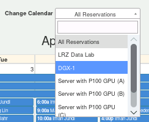
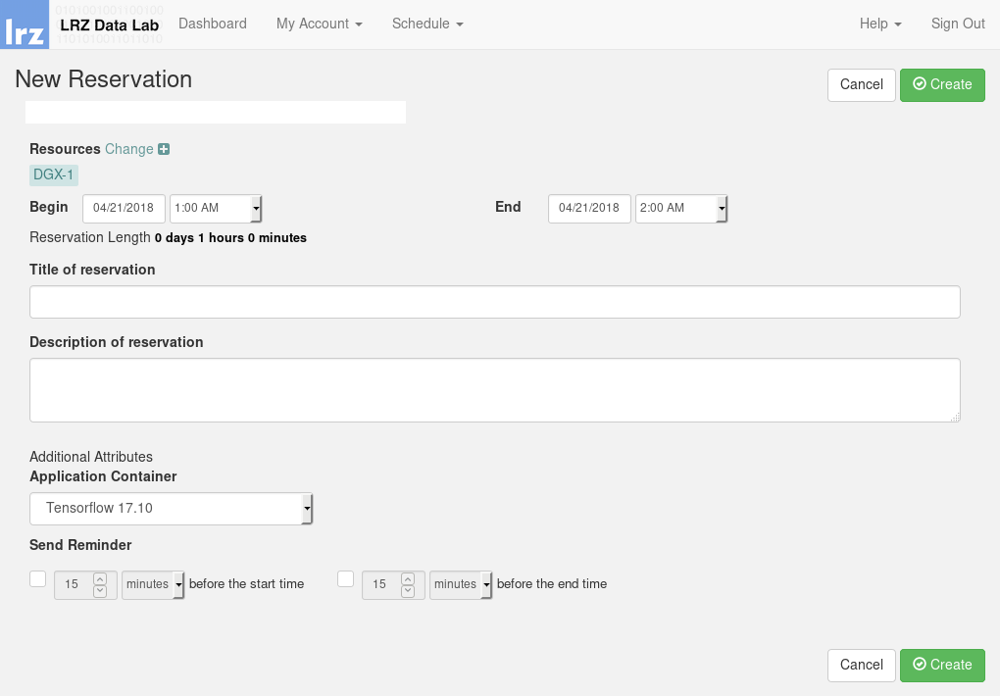

# *DGX-1*

## Make reservation

Once you have stored your public SSH key in your profile settings, you can
make a reservation on the *DGX-1*.

Goto "Schedule" and click on "Resource Calender". Now you can see the full
calender with all booked reservations. Under the "Change Calendar" option you
can filter the available LRZ resources. We use *DGX-1* now:



Now you can find a free slot in the calendar. Click on a desired calendar date
and choose "Create reservation". The following dialog pops up:



You are now able to specify duration and the desired container. In this example
we choose the latest "TensorFlow" container.

## Login into container

Once your reservation is ready, you will receive an email with the following
subject:

> "Your DGX-1 application "TensorFlow 17.10" is ready.

Within the MWN you can now login into the container using your previously
created key:

```bash
ssh -p 10022 -l <your-lrz-kennung> -i ~/id_rsa.pub <ip-address-mail>
```

You need to specify your LRZ kennung, public key and the IP address of the
container. You find the IP address in the email.

You will be asked for your password of the SSH key. When everything was setup
correctly you are now logged in. Congratulations!

# Container - first steps

Inside the container you can install your desired software packages. The
next steps shows the installation of some very useful tools when you are working
in the container.

## Update

It is highly recommended to update/upgrade the *Ubuntu* package list via:

```bash
sudo apt update && sudo apt upgrade
```
