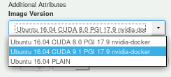

# Virtual server with 1 P100

## Make reservation

Once you have stored your public SSH key in your profile settings, you can
make a reservation on the a virtual server with a single NVIDIA P100 GPU.

Goto "Schedule" and click on "Resource Calender". Now you can see the full
calender with all booked reservations. Under the "Change Calendar" option you
can filter the available LRZ resources. We use a virtual server with a single
P100 now. You can find a free slot in the calendar. Click on a desired calendar
date and choose "Create reservation". The following dialog pops up:



You are now able to specify duration and the desired image. In this example
we choose "Ubuntu 16.04 CUDA 9.1 PGI 17.9 nvidia-docker".

## Login to virtual server

Once your reservation is ready, you will receive an email with the following
subject:

> "Your GPU-enabled server in Slot [A-D] is ready.

Within the MWN you can now login into the container using your previously
created key:

```bash
ssh -l ubuntu -i ~/id_rsa.pub <ip-address-mail>
```

You need to specify your LRZ kennung, public key and the IP address of the
container. You find the IP address in the email.

You will be asked for your password of the SSH key. When everything was setup
correctly you are now logged in. Congratulations!

**Notice**: Do not panic when you do not receive an email immediately after your
reservation time! Normally it takes approx. 3 minutes until the image is ready
for use.

# Virtual server - first steps

Inside the image of the virtual server you can install your desired software
packages and use *Docker* for running your software inside a *Docker* container.

In this tutorial we will use a *Docker* image for *TensorFlow* and *Keras*.
This image needs to be built first. After that, `nvidia-docker` is used to run
*Docker* images.

Of course you can use other *Docker* images. Here comes a short list of possible
options:

* Offical NVIDIA [Docker Hub](https://hub.docker.com/r/nvidia/cuda/) - several
  images for different *CUDA* and *cudnn* versions are available

* NVIDIA [Compute Cloud](https://www.nvidia.com/en-us/gpu-cloud/) - after
  registration you will get access to NVIDIA optimized containers for e.g.
  *TensorFlow*, *PyTorch* and many more. These containers are pretty the same
  as containers on the *DGX-1*.

In this tutorial we will use the *TensorFlow* image from
[here](https://github.com/stefan-it/deep-docker) as example.

## *Docker* configuration

With the "normal" *Docker* configuration a strange bug with `https` connections
will apear inside a *Docker* container - e.g. `apt` is not able to retrieve
`https` packages:

```bash
Err:22 https://developer.download.nvidia.com/compute/cuda/repos/ubuntu1604/x86_64  InRelease
  Operation timed out after 0 milliseconds with 0 out of 0 bytes received
```

After several hours of investigations, it turns out that the *MTU* size must be
adjusted. For more information see [this](https://github.com/moby/moby/issues/2011)
bug report.

To adjust the *MTU* size the following commands must be executed to "patch" the
*Docker* configuration:

```bash
sudo sed -i 's#\(/usr/bin/dockerd\)#\1 --mtu=1200#g' /lib/systemd/system/docker.service

sudo systemctl daemon-reload

sudo systemctl restart docker
```

Please make sure that `/usr/bin/dockerd` is properly started with the
`--mtu=1200` option:

```bash
$ ps aux | grep dockerd
root      2236  1.7  0.0 1075872 38932 ?       Ssl  15:17   0:00 /usr/bin/dockerd --mtu=1200 -H fd://
```

## Build *Docker* image

Now the *TensorFlow* image can be built with:

```bash
sudo docker build -t keras https://github.com/stefan-it/deep-docker.git#master:keras
```

## Start *Docker* container

Then `nvidia-docker` can be used to run the container.

The virtual server provides a huge SSD storage with 800 GB of space. The
mount point of the SSD storage is also mounted in the *Docker* container. Thus,
you can put your software and data under `/ssdtemp` in the virtual server and
you can access it under `/mnt` in the *Docker* container later:

```bash
nvidia-docker run -v "/ssdtemp/:/mnt" -it --rm keras
```

When everything was set up correctly, you should be inside the *Docker* container
now (with a new login prompt).

## Optional: Train a convolutional neural network for text classification

To test the *TensorFlow* and *Keras* installation, a training example from
*Keras* is used:

```bash
apt install wget
wget "https://raw.githubusercontent.com/keras-team/keras/master/examples/imdb_cnn.py"
python3 imdb_cnn.py
```

Now a convolutional neural network will be trained for text classification.
The output should look like:

```bash
/usr/local/lib/python3.5/dist-packages/h5py/__init__.py:36: FutureWarning: Conversion of the second argument of issubdtype from `float` to `np.floating` is deprecated. In future, it will be treated as `np.float64 == np.dtype(float).type`.
  from ._conv import register_converters as _register_converters
Using TensorFlow backend.
Loading data...
Downloading data from https://s3.amazonaws.com/text-datasets/imdb.npz
17465344/17464789 [==============================] - 108s 6us/step
25000 train sequences
25000 test sequences
Pad sequences (samples x time)
x_train shape: (25000, 400)
x_test shape: (25000, 400)
Build model...
Train on 25000 samples, validate on 25000 samples
Epoch 1/2
2018-05-05 00:56:12.112260: I tensorflow/core/platform/cpu_feature_guard.cc:140] Your CPU supports instructions that this TensorFlow binary was not compiled to use: AVX2 FMA
2018-05-05 00:56:12.236857: I tensorflow/stream_executor/cuda/cuda_gpu_executor.cc:898] successful NUMA node read from SysFS had negative value (-1), but there must be at least one NUMA node, so returning NUMA node zero
2018-05-05 00:56:12.237401: I tensorflow/core/common_runtime/gpu/gpu_device.cc:1356] Found device 0 with properties:
name: Tesla P100-PCIE-16GB major: 6 minor: 0 memoryClockRate(GHz): 1.3285
pciBusID: 0000:00:05.0
totalMemory: 15.89GiB freeMemory: 15.60GiB
2018-05-05 00:56:12.237464: I tensorflow/core/common_runtime/gpu/gpu_device.cc:1435] Adding visible gpu devices: 0
2018-05-05 00:56:12.490875: I tensorflow/core/common_runtime/gpu/gpu_device.cc:923] Device interconnect StreamExecutor with strength 1 edge matrix:
2018-05-05 00:56:12.491033: I tensorflow/core/common_runtime/gpu/gpu_device.cc:929]      0
2018-05-05 00:56:12.491056: I tensorflow/core/common_runtime/gpu/gpu_device.cc:942] 0:   N
2018-05-05 00:56:12.491568: I tensorflow/core/common_runtime/gpu/gpu_device.cc:1053] Created TensorFlow device (/job:localhost/replica:0/task:0/device:GPU:0 with 15119 MB memory) -> physical GPU (device: 0, name: Tesla P100-PCIE-16GB, pci bus id: 0000:00:05.0, compute capability: 6.0)
25000/25000 [==============================] - 14s 580us/step - loss: 0.4037 - acc: 0.8004 - val_loss: 0.3206 - val_acc: 0.8623
Epoch 2/2
25000/25000 [==============================] - 9s 362us/step - loss: 0.2298 - acc: 0.9081 - val_loss: 0.3070 - val_acc: 0.8721
```
